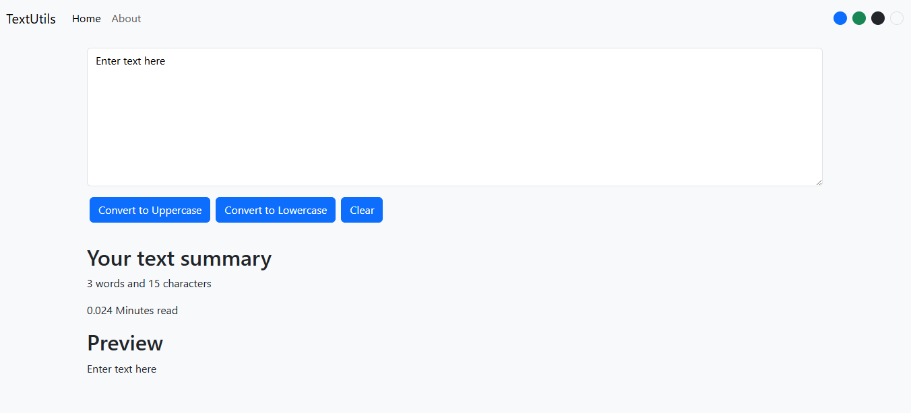

# 📝 TextUtils - React Text Utility App

A simple and responsive text utility application built with **React.js**. It allows users to perform common text transformations, analyze text statistics, and preview content in real time.

---

## 🚀 Features

- 🔠 Convert text to **Uppercase**
- 🔡 Convert text to **Lowercase**
- 🗑️ Clear text instantly
- 📊 Live word count
- 🔢 Character count
- ⏱️ Estimated reading time
- 👀 Live text preview
- 🎨 Multiple theme color options
- 📱 Responsive user interface

---

## 🛠️ Technologies Used

- React.js
- JavaScript (ES6)
- HTML5
- CSS3
- Bootstrap

---

## 📂 Project Structure

```text
src/
│
├── components/
│   ├── Navbar.jsx
│   ├── TextForm.jsx
│   └── About.jsx
│
├── App.js
├── App.css
├── index.js
└── index.css
```

---

## 📸 Preview



---

## ✨ Functionalities

- Convert entered text to uppercase
- Convert entered text to lowercase
- Clear the text area
- View live word count
- View character count
- Calculate estimated reading time
- Preview text before copying or using it
- Switch between multiple theme colors

---

## ▶️ Getting Started

### Clone the repository

```bash
git clone https://github.com/YOUR_USERNAME/textutils-react.git
```

### Navigate into the project

```bash
cd textutils-react
```

### Install dependencies

```bash
npm install
```

### Start the development server

```bash
npm start
```

The application will run at:

```text
http://localhost:3000
```

---

## 🎯 Learning Outcomes

This project helped practice:

- React Components
- Props
- useState Hook
- Event Handling
- Conditional Rendering
- Controlled Components
- State Management
- Responsive UI Design

---

## 📄 License

This project was built for learning React and frontend development.